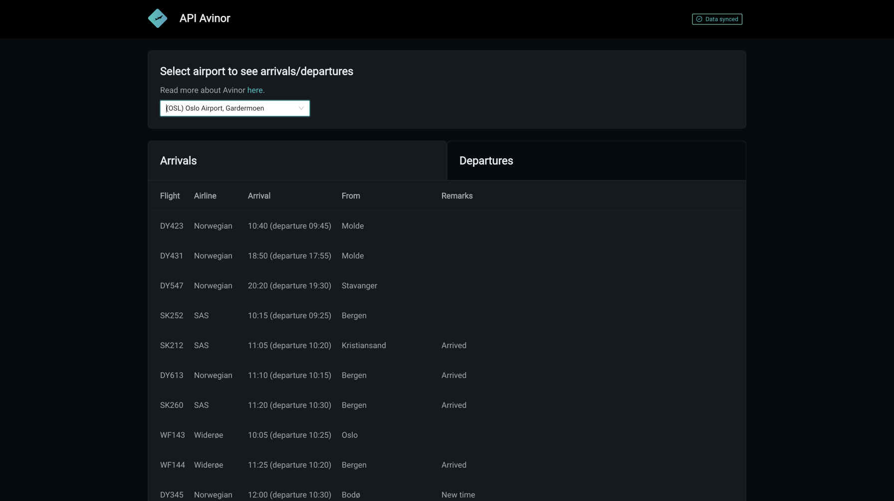

# Approach and solution 

## Possible approaches: 
- **Server side rendering**. Requests are polled and cached every 3min and 24 hours and cached on the server. Then delivered to clients with no 'compute' latency on the server. Basically a shared cache. Less work for avinors server.
- **Set up own server that polls and cach the data in e.g redis locally**. Then clients query this server instead. Same concept as SSR but does not require a SSR framework atleast. 
- **Client side queries on relevant aiports only.** Longer time per fetch if on switch, but can be alliviated with with private caching, seeing alot of the same airports will be queried each time. Can also use last_update to reduce payload each time.  
- **Client side fetch-all-data-every-3-minutes.** Longer initial wait time, more memory that is unused, more queries to server, but once loaded it can give a super fast user experience after initial load. 

## Choosen approach 
**Client side queries on relevant aiports only**
  - Might not be ideal, but fastest to implement and no server involved
  - Uses a cors server on heroku to prevent CORS errors

## How to use
Clone repo and run ```yarn && yarn vite ```

In addition, the application is deployed to two urls: 
- with a external proxy cerver for CORS: [avinor-api-corsproxy.surge.sh](https://avinor-api-corsproxy.surge.sh/).
- without any proxy stuff. You need to use a chrome extention or something: [avinor-api-nocorsproxy.surge.sh](https://avinor-api-nocorsproxy.surge.sh/).




### Interesting questions to answer
- webworkers?
    - Might be nice, but as payload is small the parsing/formatting time might very well be equal to the copy operation between the treads. 
- shared vs local cache?
    - Depends on the approach (ssr or client-side). Would prefer not to add custom cache logic atleast. Fetch API and XHR has build in cache with ttt, but might have problems with server headeres(cors etc)
- test?
    - No. Always nice but not on this small project 


### Some of the edge cases to handle:
- the API returns different formats based on if a airport has 0, 1, or  2+ flights
- some flights might not match
- CORS using a https://github.com/Rob--W/cors-anywhere server to proxy the request.


### TODOs and notes about the implementation:
- to inconsisten with typescript () and ({}) inputs.
- takes some shortcuts with type 'any' when it gets complicated. Also still some typescript errors lying around. Not good.
- incosistent with type/interface naming
- not using update_key to minimize the paylaod
- error handling not ideal 
- error handling for CORS not ideal
- visulize unmatched flights not ideal
- responsiveness not ideal. Only works on a certain range of screen sizes (not on mobile)
- not added proper private caching
- pushed directly to master. But only member so not the worst thing that can happen

# TODO: 
- add new remote repo
    - git remote add origin git@github.com:andykamp/FlyMe.git
    - git branch -M main
    - git push -u origin main
